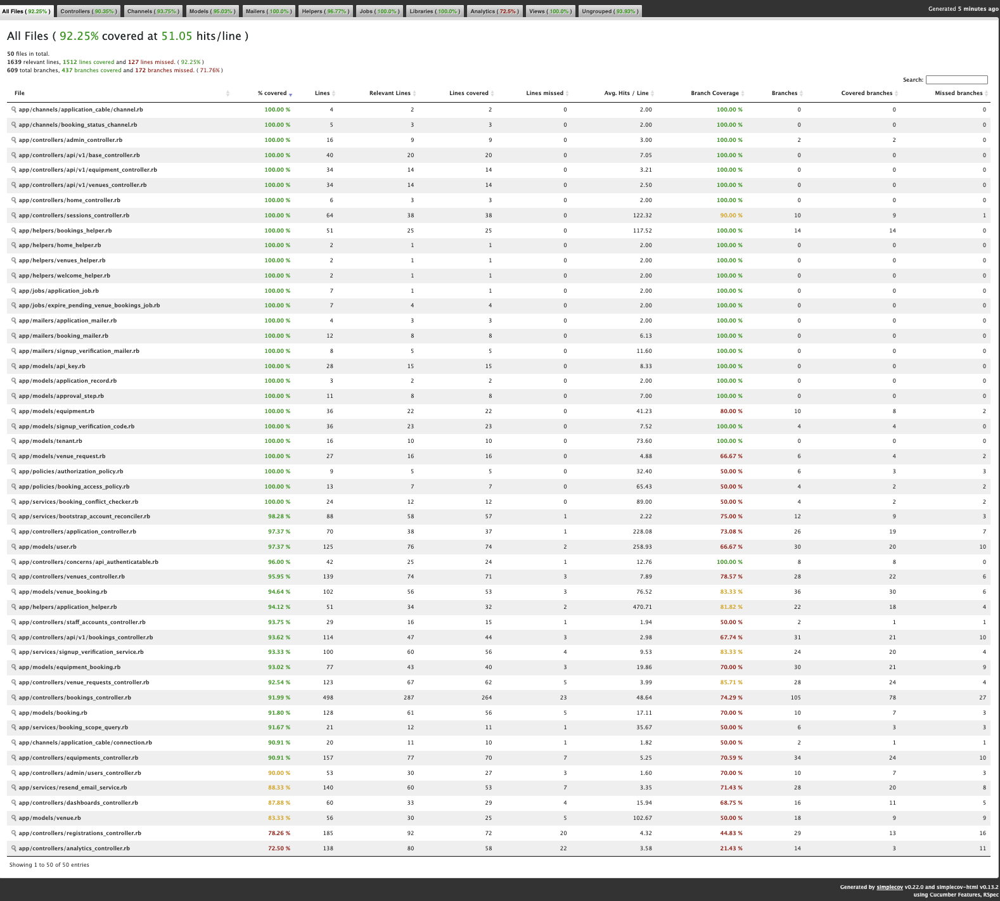

# CUHK Booking System

[](https://github.com/Jacky27375/cuhk-booking-system/actions/workflows/ci.yml)
[](https://github.com/Jacky27375/cuhk-booking-system/actions/workflows/deploy-azure.yml)

CUHK Booking System is **Option A** from the CSCI3100 Spring 2026 project spec: a multi-tenant SaaS for booking venues and equipment across CUHK colleges, with conflict detection and approval workflows.

## 1. Spec Alignment

This repository aligns with the key spec requirements:

- **SaaS + multi-tenant architecture** (college/university scoped resources and authorization)
- **Core feature coverage** (booking conflict checks + approval workflow)
- **Testing stack required by spec** (`RSpec` + `Cucumber`) integrated in GitHub Actions
- **Public cloud deployment** (Azure VM deployment workflow + `/up` health check)

## 1.1 End-Product Feature Showcase (Core + Advanced)

This section is designed for fast TA review: **what is implemented**, **why it matters**, and **where to verify it**.

### Core Features (Option A Requirements)

| Core requirement from project spec | What is implemented in this product | Where to verify quickly |
| --- | --- | --- |
| Conflict detection (prevent double booking) | Date-based venue timetable, unavailable slot filtering, end-slot dependency on start-slot, overlap rejection, and booking-duration constraints | [features/booking_timetable.feature](features/booking_timetable.feature), [app/services/booking_conflict_checker.rb](app/services/booking_conflict_checker.rb), [app/models/venue_booking.rb](app/models/venue_booking.rb) |
| Approval workflow | Pending -> under-review (for two-step tenants) -> approved/rejected, rejection reasons, owner cancellation controls, and approval history records | [features/approval_workflow.feature](features/approval_workflow.feature), [app/controllers/bookings_controller.rb](app/controllers/bookings_controller.rb), [app/models/approval_step.rb](app/models/approval_step.rb), [app/views/dashboards/approvals.html.erb](app/views/dashboards/approvals.html.erb) |
| SaaS multi-tenant isolation | Tenant-aware visibility/scoping for venues, equipment, and bookings; role-based access boundaries for student/staff/admin | [features/tenant_access_control.feature](features/tenant_access_control.feature), [features/staff_scoped_management.feature](features/staff_scoped_management.feature), [app/services/booking_scope_query.rb](app/services/booking_scope_query.rb), [app/models/venue.rb](app/models/venue.rb), [app/models/equipment.rb](app/models/equipment.rb) |

### Advanced Features (N-1 Rule Evidence)

Team size is 4, so the minimum is 3 advanced features. The product includes **6**:

| Advanced feature | Why this is beyond CRUD | Where to verify quickly |
| --- | --- | --- |
| External API integration (Resend) | Transactional email delivery for approval/rejection and signup OTP verification, with API response handling and failure paths | [features/sendgrid_email.feature](features/sendgrid_email.feature), [app/services/resend_email_service.rb](app/services/resend_email_service.rb), [app/services/signup_verification_service.rb](app/services/signup_verification_service.rb) |
| Real-time updates (ActionCable/WebSocket) | Student "My Bookings" status updates and action-state sync without page refresh after staff decisions | [features/approval_workflow.feature](features/approval_workflow.feature) (`@javascript` scenarios), [app/channels/booking_status_channel.rb](app/channels/booking_status_channel.rb), [app/javascript/controllers/booking_status_controller.js](app/javascript/controllers/booking_status_controller.js) |
| Background job automation | Scheduled auto-rejection of expired pending venue bookings to keep approval queue consistent | [app/jobs/expire_pending_venue_bookings_job.rb](app/jobs/expire_pending_venue_bookings_job.rb), [config/recurring.yml](config/recurring.yml), [features/approval_workflow.feature](features/approval_workflow.feature) |
| Analytics dashboard (interactive charts) | Multi-metric operational analytics (status distribution, occupancy, trends, heatmap, equipment utilization) with date-range filtering | [features/analytics_dashboard.feature](features/analytics_dashboard.feature), [app/controllers/analytics_controller.rb](app/controllers/analytics_controller.rb), [app/views/analytics/show.html.erb](app/views/analytics/show.html.erb), [app/javascript/controllers/chart_controller.js](app/javascript/controllers/chart_controller.js) |
| API v1 with token auth | Programmatic access layer with API key authentication, role-based scoping, and pagination for venues/equipment/bookings | [config/routes.rb](config/routes.rb), [app/controllers/concerns/api_authenticatable.rb](app/controllers/concerns/api_authenticatable.rb), [app/controllers/api/v1/bookings_controller.rb](app/controllers/api/v1/bookings_controller.rb) |
| Security hardening (session lock + signup verification gate) | Single active web session lock, session lock expiry/touch policy, and verified-email signup gate with OTP + resend/attempt limits | [app/controllers/sessions_controller.rb](app/controllers/sessions_controller.rb), [app/controllers/application_controller.rb](app/controllers/application_controller.rb), [app/controllers/registrations_controller.rb](app/controllers/registrations_controller.rb), [app/models/signup_verification_code.rb](app/models/signup_verification_code.rb) |

## 2. Tech Stack

- **Ruby:** `3.4.8` (`.ruby-version`)
- **Rails:** `~> 8.1.2` (`Gemfile`)
- **Database:** PostgreSQL (multi-db roles: `primary`, `cache`, `queue`, `cable`)
- **Frontend:** ERB + Turbo + Stimulus
- **Realtime:** ActionCable
- **Testing:** RSpec, Cucumber, SimpleCov

## 3. Deployment (Azure VM)

Production URL: `https://csci3100.tylerl.cyou`

- CI workflow: `.github/workflows/ci.yml`
- CD workflow: `.github/workflows/deploy-azure.yml`
- Runtime compose file: `deploy/docker-compose.azure.yml`

### Required GitHub repository secrets

| Secret | Required | Notes |
| --- | --- | --- |
| `AZURE_VM_HOST` | Yes | VM public IP or DNS |
| `AZURE_VM_SSH_KEY` | Yes | Private key content for SSH |
| `RAILS_MASTER_KEY` | Yes | Must match `config/credentials.yml.enc` |
| `SECRET_KEY_BASE` | Yes | Generate with `openssl rand -hex 64` |
| `POSTGRES_PASSWORD` | Yes | Production Postgres password |
| `BOOTSTRAP_ACCOUNT_PASSWORD` | Yes | Required by `db/seeds` in production |
| `RESEND_API_KEY` | Yes | Required for email delivery |
| `RESET_BOOTSTRAP_ACCOUNTS_ONCE` | Optional | One-time password reset switch for bootstrap accounts |

### Deployment behavior

The CD workflow deploys to `/opt/cuhk-booking-system`, starts containers with Docker Compose, and health-checks `GET /up`. On failed health checks, it rolls back to the previous release automatically.

## 4. Local Development Setup

### Prerequisites

- Git
- Ruby `3.4.8` (see `.ruby-version`)
- Bundler (`gem install bundler`)
- PostgreSQL reachable at `127.0.0.1:5432` with user/password `postgres`/`postgres` (defaults in `config/database.yml`)

You can provide PostgreSQL in either way:

1. Local PostgreSQL service
2. Docker container (recommended):

```bash
# First time only (create container)
docker run -d \
  --name cuhk-booking-postgres \
  -e POSTGRES_USER=postgres \
  -e POSTGRES_PASSWORD=postgres \
  -p 5432:5432 \
  -v cuhk-booking-postgres-data:/var/lib/postgresql/data \
  postgres:16

# Next runs
docker start cuhk-booking-postgres
```

### Start locally

```bash
git clone <repository_url>
cd cuhk-booking-system
# If using Docker Postgres and container already exists:
# docker start cuhk-booking-postgres
bin/setup --skip-server
bin/dev
```

The app is available at: `http://localhost:3000`

### Reset + reseed demo data

```bash
bin/rails reset
```

`bin/rails reset` maps to `db:reset` and reseeds the project demo dataset.

## 5. Seed Data and Demo Accounts

Running `bin/rails reset` or `bin/rails db:seed` ensures:

- 10 tenants total (**9 colleges + University**)
- Seeded venue and equipment records from `db/seeds.rb`
- Seeded demo bookings (one venue booking + one equipment booking per demo student)
- Seeded staff-submitted request records (venue and equipment-themed)
- Bootstrap admin/root/demo user accounts

### Seed password behavior for all demo accounts (IMPORTANT)

- **Development/Test:** `DEV_BOOTSTRAP_ACCOUNT_PASSWORD` if set, otherwise `Password1!`
- **Production:** `BOOTSTRAP_ACCOUNT_PASSWORD` is required. The secret we used is provided in BlackBoard submission. 

### Login accounts

**Admin**

| Role | Email | Password (Dev/Test) |
| --- | --- | --- |
| Admin | `admin@link.cuhk.edu.hk` | `Password1!` (unless overridden by bootstrap env vars above) |

**Root staff + demo student (one per college)**

| Tenant/College | Root staff email | Demo student email |
| --- | --- | --- |
| University | `staff_root_university@link.cuhk.edu.hk` | - |
| Chung Chi College | `staff_root_chungchi@link.cuhk.edu.hk` | `demo_student_chungchi@link.cuhk.edu.hk` |
| New Asia College | `staff_root_newasia@link.cuhk.edu.hk` | `demo_student_newasia@link.cuhk.edu.hk` |
| United College | `staff_root_united@link.cuhk.edu.hk` | `demo_student_united@link.cuhk.edu.hk` |
| Shaw College | `staff_root_shaw@link.cuhk.edu.hk` | `demo_student_shaw@link.cuhk.edu.hk` |
| Morningside College | `staff_root_morningside@link.cuhk.edu.hk` | `demo_student_morningside@link.cuhk.edu.hk` |
| S.H. Ho College | `staff_root_shho@link.cuhk.edu.hk` | `demo_student_shho@link.cuhk.edu.hk` |
| CW Chu College | `staff_root_cwchu@link.cuhk.edu.hk` | `demo_student_cwchu@link.cuhk.edu.hk` |
| Wu Yee Sun College | `staff_root_wuyeesun@link.cuhk.edu.hk` | `demo_student_wuyeesun@link.cuhk.edu.hk` |
| Lee Woo Sing College | `staff_root_leewoosing@link.cuhk.edu.hk` | `demo_student_leewoosing@link.cuhk.edu.hk` |

Student self-registration is also available on `/signup` and is restricted to the college allow-list in `RegistrationsController`.

## 6. Test and Quality Commands

Before running test suites:

```bash
RAILS_ENV=test bin/rails db:create db:prepare
```

| Purpose | Command |
| --- | --- |
| RSpec suite | `bundle exec rspec` |
| Cucumber suite | `bundle exec cucumber` |
| RuboCop | `bin/rubocop` |
| Brakeman | `bin/brakeman --no-pager` |
| Bundler audit | `bin/bundler-audit` |
| Importmap audit | `bin/importmap audit` |
| Local CI script | `bin/ci` |
| Match GitHub CI checks locally | `bin/rubocop && bin/brakeman --no-pager && bin/bundler-audit && bin/importmap audit && bundle exec rspec && bundle exec cucumber` |

`bin/ci` prepares a clean test database, runs the same active test suites as project CI (`bundle exec rspec` + `bundle exec cucumber`), and then replants test seeds.

The following canonical journeys are covered by stable Cucumber scenarios:

| Journey ID | Canonical journey | Scenario coverage | Expected outcome |
| --- | --- | --- | --- |
| J-01 | Authentication and role access | [features/authentication.feature](features/authentication.feature) scenarios: `Successful login as admin`, `Successful login as staff`, `Successful login as student`, `Failed login with incorrect password`, `Failed login with non-existent email`, `User logs out`, `Unauthenticated user is redirected to login`; [features/role_access.feature](features/role_access.feature) scenarios: `Admin can access admin panel`, `Admin dashboard hides My Bookings link`, `Admin cannot access My Bookings page directly`, `Admin cannot edit a booking` | Users can sign in and are blocked from unauthorized areas. |
| J-02 | Venue booking slot selection and validation | [features/booking_timetable.feature](features/booking_timetable.feature) scenarios: `Timetable shows booked and available slots for selected date`, `Unavailable start time options are hidden`, `End time appears only after start time and only shows valid slots`, `Booking with non hourly increments is rejected`, `Selected slot is highlighted on edit page` | Available slots are shown first, invalid times stay hidden or rejected, and the selected slot remains visible during edits. |
| J-03 | Booking approval lifecycle | [features/approval_workflow.feature](features/approval_workflow.feature) scenarios: `Staff sees pending booking requests`, `Staff approves a booking`, `Two-step tenant requires two approvals before final approval`, `Staff cannot manage bookings from another department`, `Staff cannot approve another department booking via direct request`, `Society member cannot access approval dashboard`, `Society member can cancel own pending booking`, `Pending booking is automatically rejected after its booking date passes`, `Student is notified in real-time when booking is approved` | Staff can review and act on bookings, unauthorized users are blocked, expired pending bookings are auto-rejected, and approvals trigger notifications. |
| J-04 | Venue request submission and admin review | [features/venue_requests.feature](features/venue_requests.feature) scenarios: `Staff can submit a venue request`, `Admin can approve a venue request`, `Admin can reject a venue request`, `Admin panel links directly to pending venue-request review`, `Admin sees all pending staff venue requests on approval dashboard`, `Staff approval dashboard does not show pending venue requests`, `Student cannot access venue requests` | Staff can submit requests, admins can review and see all pending requests, and non-admin users do not see the admin request queue. |

Each journey above has at least one positive scenario and, where it matters, a stable negative-path check.

## 7. Coverage Evidence (SimpleCov)

SimpleCov is enabled with `minimum_coverage 80` in `.simplecov`.

After running test suites, coverage artifacts are available at:

- Local HTML report: `coverage/index.html`
- Local Cobertura XML: `coverage/coverage.xml`
- GitHub Actions artifact: `merged-coverage-report`

#### SimpleCov Report


## 8. API v1 Quick Reference

API v1 uses token auth and returns JSON. Local base URL is usually `http://localhost:3000`.

### Authentication

- Preferred: `Authorization: Bearer <api_key>`
- Fallback: `api_key` request parameter

> **Note on API Key Management:** API key issuance is currently restricted to the Rails console. This is an intentional MVP design choice to minimize the security attack surface and enforce manual administrative vetting for programmatic integration requests. A self-service management UI is slated for a future iteration.

To create an API key, run this using the Rails runner:

```bash
bin/rails runner 'user = User.find_by!(email: "demo_student_shaw@link.cuhk.edu.hk"); key = user.api_keys.create!(name: "TA Demo Key", expires_at: 30.days.from_now); puts key.token'
```

### Routes

| Method | Path | Notes |
| --- | --- | --- |
| `GET` | `/api/v1/venues` | List visible venues |
| `GET` | `/api/v1/venues/:id` | Show one visible venue |
| `GET` | `/api/v1/equipment` | List visible equipment with availability |
| `GET` | `/api/v1/equipment/:id` | Show one visible equipment item |
| `GET` | `/api/v1/bookings` | List bookings in caller scope |
| `GET` | `/api/v1/bookings/:id` | Show one booking in caller scope |
| `POST` | `/api/v1/bookings` | Create booking (**student role only**) |

### Query parameters

- Pagination on list endpoints: `page` (default `1`), `per_page` (default `25`, max `100`)
- `GET /api/v1/bookings` filters: `status` (for example `pending`, `approved`, `rejected`) and `type` (`venue` or `equipment`)

### Booking create payloads

Venue booking:

```json
{
  "booking_type": "venue",
  "venue_id": 1,
  "start_time": "2026-04-20T10:00:00+08:00",
  "end_time": "2026-04-20T12:00:00+08:00"
}
```

Equipment booking:

```json
{
  "booking_type": "equipment",
  "equipment_id": 3,
  "quantity": 2,
  "start_date": "2026-04-20",
  "end_date": "2026-04-22"
}
```

### Example usage

```bash
API_KEY="<paste_api_key_here>"
BASE_URL="http://localhost:3000"

curl -s -H "Authorization: Bearer $API_KEY" "$BASE_URL/api/v1/venues"
curl -s -H "Authorization: Bearer $API_KEY" "$BASE_URL/api/v1/equipment?page=1&per_page=10"
curl -s -H "Authorization: Bearer $API_KEY" "$BASE_URL/api/v1/bookings?status=pending&type=venue"
```

### Access scope and common responses

- Admin: sees all records
- Staff: sees tenant-scoped records
- Student: sees own bookings only
- `POST /api/v1/bookings` by non-student returns `403 Forbidden`
- Missing/invalid/inactive/expired key returns `401 Unauthorized`
- Requesting out-of-scope records returns `404 Not Found`
- Validation failures return `422 Unprocessable Content`

## 9. Implemented Features and Ownership

Ownership is calculated from **non-merge** commits only, weighted by **line impact** (`added + deleted`) on mapped feature files/directories, with bot commits (for example Dependabot) excluded.

| Implemented Feature | Contributors (Strict Audit %) | Notes |
| --- | --- | --- |
| Authentication & Session Security | Tyler 75.07%; Jacky 13.88%; Joe 5.93%; Sam 5.12% | Mapped auth/session files (`SessionsController`, `ApplicationController`, `User`), auth policy, auth Cucumber scenarios, and session-token migrations. |
| Student Registration & Verification Codes | Tyler 69.85%; Joe 12.67%; Jacky 10.19%; Sam 7.29% | Mapped signup flow (`RegistrationsController`), verification model/service, signup mailer views, registration Cucumber coverage, and verification-code migration. |
| Tenant Isolation & Scoped Visibility | Jacky 47.45%; Joe 34.38%; Tyler 13.96%; Sam 4.20% | Mapped tenant/visibility scope files (`Tenant`, `Venue`, `Equipment`, `BookingScopeQuery`, `BookingAccessPolicy`) plus tenant-isolation scenarios/specs. |
| Venue Management (CRUD + Sorting) | Jacky 64.96%; Sam 17.20%; Tyler 10.02%; Joe 7.82% | Mapped venue CRUD/sorting files (`VenuesController`, venue views/helpers), sorting BDD coverage, request/view/routing specs, and venue schema migrations. |
| Equipment Inventory & Borrowing | Sam 58.98%; Jacky 36.45%; Tyler 2.99%; Joe 1.57% | Mapped equipment inventory + borrow flow (`EquipmentsController`, `EquipmentBooking`, equipment views), equipment booking scenarios/specs, and equipment/STI migrations. |
| Venue Booking Timetable & Conflict Checks | Jacky 78.21%; Tyler 12.93%; Sam 5.13%; Joe 3.73% | Mapped timetable/conflict files (`BookingConflictChecker`, booking-time Stimulus controller, `VenueBooking` validations, timetable views) with BDD/spec coverage. |
| Approval Workflow, Lifecycle & Realtime Status | Jacky 39.32%; Tyler 21.57%; Sam 21.33%; Joe 17.79% | Mapped booking lifecycle + approvals (`BookingsController`, `DashboardsController`, `Booking`, `ApprovalStep`), expiry job, ActionCable status updates, approval scenarios, and related specs/migrations. |
| Venue Request Workflow | Tyler 56.68%; Joe 41.32%; Jacky 2.00% | Mapped staff submit/admin review flow (`VenueRequestsController`, `VenueRequest`, venue-request views), venue-request scenarios/specs, and migration. |
| Admin User & Staff Account Management | Tyler 51.92%; Joe 42.09%; Sam 5.99% | Mapped admin/staff account surfaces (`Admin::UsersController`, `StaffAccountsController`, admin/staff views), staff-account scenarios, and admin/staff request specs. |
| Analytics Dashboard & Reporting | Sam 82.56%; Jacky 17.29%; Joe 0.15% | Mapped analytics implementation (`AnalyticsController`, analytics dashboard view, chart Stimulus controller), analytics BDD scenarios, and analytics specs. |
| API v1 & API Key Authentication | Joe 94.89%; Jacky 4.19%; Sam 0.92% | Mapped API boundary (`Api::V1::*`, `ApiAuthenticatable`, `ApiKey`), API request/model specs, and API-key migration. |
| Email Delivery Integration (SendGrid/Resend) | Joe 72.35%; Tyler 23.27%; Sam 2.55%; Jacky 1.84% | Mapped booking email delivery services (legacy SendGrid + current Resend), booking mailers/views, email BDD scenario, and service/mailer specs. |
| Seed Data & Bootstrap Account Provisioning | Jacky 49.63%; Tyler 25.38%; Joe 15.96%; Sam 9.03% | Mapped data/bootstrap provisioning files (`db/seeds.rb`, `BootstrapAccountReconciler`, reset task) and reconciler specs. |
| UI/UX Styling & Layout Polish | Sam 65.69%; Tyler 19.75%; Jacky 14.01%; Joe 0.55% | Mapped visual polish files (global stylesheet, application layout, dashboard shell, helper-level presentation updates). |
| Test Harness & BDD Infrastructure | Joe 56.42%; Sam 24.02%; Tyler 16.76%; Jacky 2.79% | Mapped test runtime/support plumbing (`spec_helper`, `rails_helper`, Cucumber support env, task wiring, test runner scripts). |
| CI/CD & Azure Deployment Pipeline | Jacky 53.57%; Tyler 45.89%; Joe 0.54% | Mapped delivery pipeline files (GitHub Actions CI/CD workflows, Azure compose/deploy files, Docker/deployment configs). |
